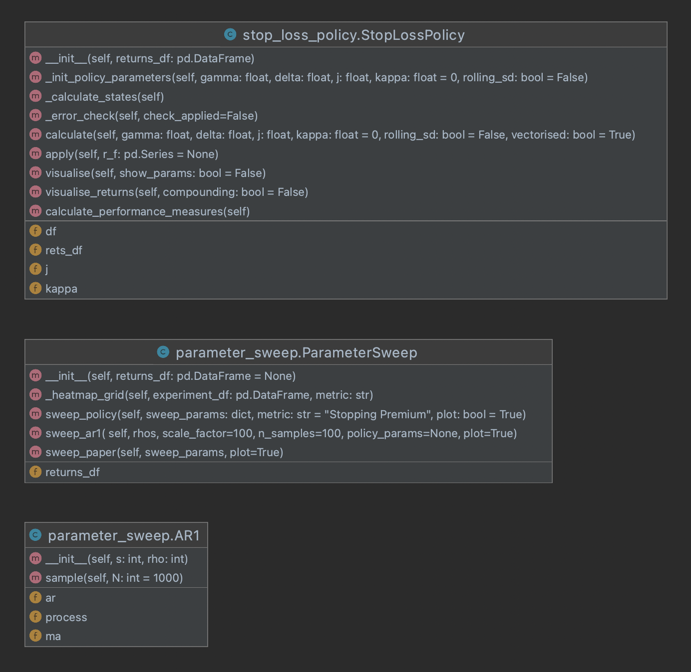

# Skill Set Challenge
---

This project contains an implementation of the stop loss policy from the paper **When do stop-loss rules stop losses?** by Kaminski, Kathryn M., and Andrew W. Lo. 

Please see the [submission notebook](./Submission.ipynb) for an overview of project API and outcomes of experiments.

# Requirements
* yfinance
* yahoo_fin
* matplotlib
* seaborn
* numba
* sympy
* unittest
* pycodestyle

# Install
`pip install -r requirements.txt`

# Way of working
* I initially read through the paper iteratively and wrote out the definitions and propositions to ensure I understood the implementation and problem statement.
* I pulled down some data and played with converting to returns and visualising stopping and re-entry parameters as thresholds over time, which assisted more with intuitive understanding of the policy and led to the first plotting utility.
* I knew I needed to vectorise the policy and was trying to use boolean logic to set up a vector state machine however `numba`'s JIT compilation decorator made life much simpler.
* I further developed the experiment notebook and had a collection of functions applied as a pipeline to the dataframe.
* After this point I considered my API design and constructed 2 seperate classes - one for the policy itself and another for all utils and experimentation. Once happy with the framework, I cleaned up visualisations, added docstrings and wrote unit tests.
* Finally I added experiment details and wrote up the report.

# Design choices
1. Modular API consisting of a class for the Stop Loss Policy to apply to a sequence of portfolio returns.
2. Stacked visualisations for a clear understanding of where policy states are changing over time and comparison of portfolio returns.
3. Multiple parameter sweep methods each covering a different experiment - requires minimal configuration from the end user and allows for practical application (sweep 1) or checking theoretical/analytical derivations from the paper (sweeps 2 & 3).
4. Helper functions in classes to keep functions small.

# UML Diagram

# Learnings
1. Using JIT compilation to vectorise the stop loss policy iteration allowed for a 70x speed up calculating state. This will make a significant impact on usability when calculating on higher volume data (such as hourly or minutely portfolio returns) or iterating sweeps across a wider range of parameters.
2. Finding a balance between specificity and generality is always difficult in designing any API. I spent a while considering how to separate class definitions and landed on keeping the policy and parameter sweeps separate. I believe this will allow for cleaner class inheritance down the line if additional generalisations of the policy (such as those defined in Section 3.2 of the source) are desired.